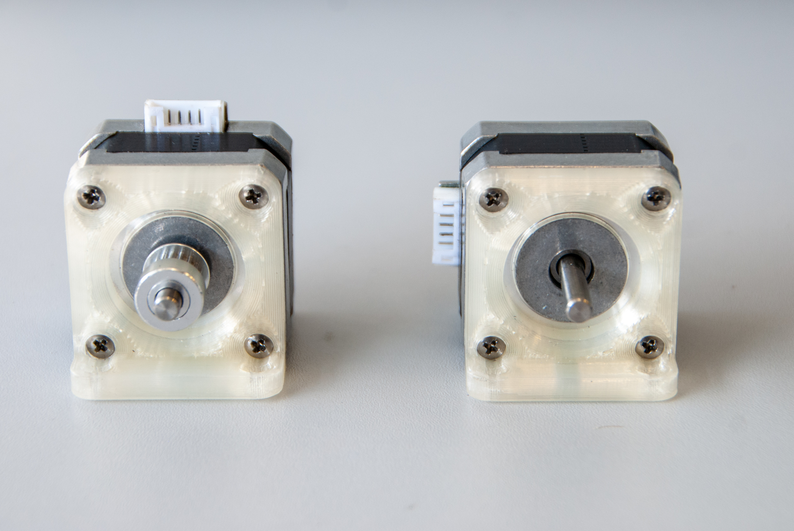
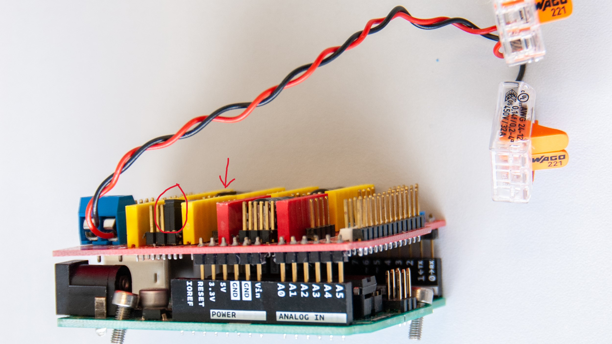
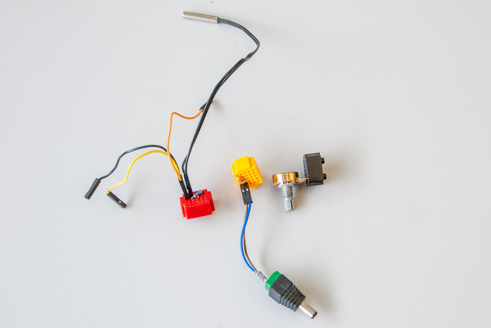
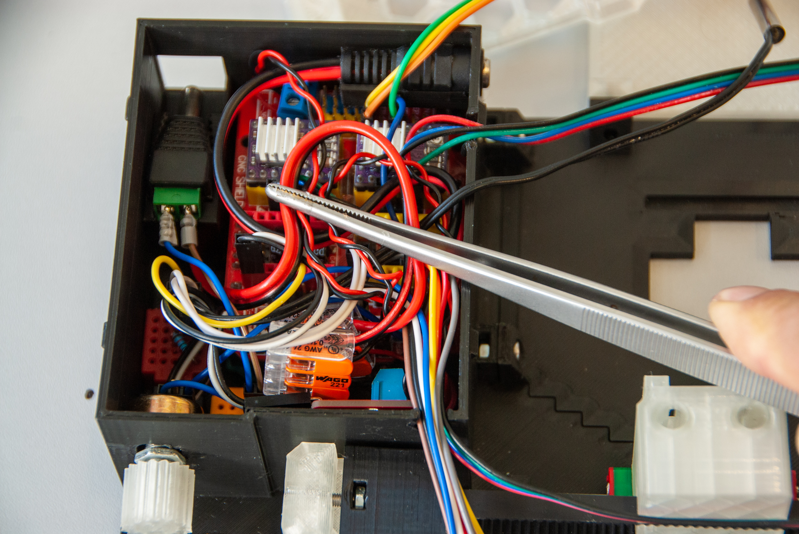

# iCat: A Multifunctional Open-Source Accessory for Advanced Light Microscopy

"i" - Innovative: iCat represents an innovative approach to light microscopy, incorporating advanced features like controlled axial rotation and tracking. It introduces a novel solution for imaging and studying biological specimens with enhanced capabilities, pushing the boundaries of traditional microscopy techniques.  
"C" - Controlled: iCat offers precise control over specimen rotation, temperature regulation, and lighting conditions, ensuring optimal imaging conditions and experimental reproducibility.  
"a" - Axial: iCat's unique capability to rotate specimens along their axial axis sets it apart from conventional light microscopy techniques, allowing researchers to observe dynamic processes and capture detailed time-lapse sequences.  
"t" - Tilt: iCat offers the unique capability of "Controlled Axial Tilt," providing researchers with a 360-degree perspective. This groundbreaking feature empowers researchers to examine specimens in three dimensions, facilitating the exploration of dynamic cellular processes, developmental biology, and beyond.  

 

# Abstract
In the field of light microscopy, imaging specimens from multiple angles and maintaining controlled temperature conditions are crucial for comprehensive and accurate analysis. To address these challenges, we present iCat, an open-source multifunctional accessory designed to revolutionize light microscopy capabilities. iCat enables the rotation of specimens along their axial axis, incorporates an in-built thermometer and Peltier element for precise temperature control, features an integrated LED light source, and is equipped with a camera. This versatile device, controlled by an Arduino-based electronic circuit and a Processing based graphical user interface (GUI), allows researchers to capture detailed images and videos of both fixed and live specimens, such as C. Elegans, Zebrafish, Drosophila, mouse embryos etc. The iCat accessory, which can be easily 3D printed and assembled using readily available electrical components, serves as a powerful tool for investigating dynamic cellular processes and complex developmental phenomena.   

# Introduction
Light microscopy has been an invaluable tool in biological research, enabling the visualization and analysis of various biological specimens with exceptional detail. However, traditional light microscopy techniques have limitations when it comes to imaging specimens from different angles and maintaining precise temperature conditions. These limitations hinder our ability to explore dynamic cellular processes, investigate complex morphological changes, and observe real-time developmental events accurately. ZMINIT RESENI DOTED (LIGHSHEET, VAST, ….)  
To address these limitations and advance the capabilities of light microscopy, we introduce iCat, a novel multifunctional accessory that combines several essential features into a single, open-source device. iCat allows researchers to rotate specimens along their axial axis, regulate the temperature within a desired range, provide ample illumination through an integrated LED light source, and capture images using its built-in camera to better navigate through the specimen. This integrated approach overcomes the challenges associated with traditional light microscopy, offering researchers a versatile tool to explore the intricacies of biological systems.   

 

# Design and Functionality
## Rotational Capabilities
The ability to capture images and videos of a specimen from multiple angles is essential for comprehensive analysis. iCat incorporates a motorized rotation mechanism that enables controlled and precise specimen rotation along its axial axis. Researchers can program the desired rotation parameters through the device's graphical user interface (GUI) and monitor the rotation progress in real-time. The iCat accessory provides unprecedented flexibility in imaging and studying dynamic processes that require specimen repositioning during time-lapse experiments, such as cell migration or morphogenesis.  
## Temperature Control
Maintaining a stable and controlled temperature environment is crucial for studying living specimens. iCat addresses this requirement through an in-built thermometer and a Peltier element. The thermometer constantly monitors the specimen's temperature, while the Peltier element actively regulates the temperature within a specified range. This temperature control feature ensures optimal imaging conditions and facilitates accurate analysis of temperature-sensitive biological processes, including embryonic development.  
## Illumination and Camera System
An appropriate and adjustable uniform light source is critical for obtaining images using the internal camera. The intensity of the LED can be adjusted via the GUI and minimizes the need for further external light sources during specimen rotation using the built-in camera. The GUI can control the image resolution, providing researchers with flexibility in controlling camera speed.   

# Fabrication and Accessibility
One of the key advantages of iCat is its open-source nature, which promotes accessibility, customization, and collaborative development. The device can be fabricated using 3D printing technology, ensuring low-cost production and ease of assembly. Additionally, all the electrical components required for iCat can be readily obtained for less than $300, making it feasible for researchers with varying resources and expertise levels to replicate and utilize the device in their laboratories. The control circuit, based on the Arduino platform, is well-documented and can be modified to accommodate specific experimental requirements.  

 

# Applications and Impact
The multifunctional capabilities of iCat open up new avenues for biological research, particularly in the fields of developmental biology, neurobiology, and cellular imaging. By enabling precise specimen rotation, temperature control, illumination, and imaging, iCat empowers researchers to investigate dynamic processes, observe intricate morphological changes, and capture real-time developmental events. The device has proven particularly effective in the study of model organisms such as C. elegans, Zebrafish, where cell migration, organogenesis, and tissue development necessitate the ability to reposition specimens during time-lapse experiments.  
Furthermore, the open-source nature of iCat fosters collaboration and encourages the scientific community to contribute to its development and enhancement. By sharing the design, software, and documentation, we aim to accelerate scientific progress and provide a versatile tool that can be adapted and customized for specific research needs.   

# Conclusion
iCat represents a significant advancement in light microscopy, addressing the limitations of traditional techniques by offering a multifunctional accessory that combines rotation, temperature control, illumination, and imaging capabilities. The open-source nature of iCat ensures its accessibility, affordability, and adaptability, making it an invaluable tool for researchers in the biological sciences. By providing a platform to investigate dynamic processes and complex developmental phenomena, iCat contributes to our understanding of fundamental biological mechanisms and facilitates discoveries in various fields of study.   

# Methods
## Supplies
One of the key advantages of iCat is its open-source nature, which promotes accessibility, customization, and collaborative development. The device can be fabricated using 3D printing technology, ensuring low-cost production and ease of assembly. All the electrical and mechanical components required for iCat can be readily obtained for less than $300, making it feasible for researchers with varying resources and expertise levels to replicate and utilize the device in their laboratories.  

### Electronics:
Arduino Uno Rev3, 1x  
Arducam 5MP Plus OV5642, 1x  
IRF520 Driver Module, 1x  
CNC Shield V3, 1x  
DRV8825 Stepper Motor Driver, 2x  
17HS2408 Stepper Motor, 2x  
Peltier plate module TEC1-12706, 1x  
NTC Thermistor 10K 1% 3950, 1x  
4.7 kOhm resistor, 1x  
10 kOhm resistor, 1x  
10K Ohm potentiometer, 1x  
3W High Power LED Module LED with PCB Chassis for Arduino, 1x  
12V 3A Power Supply, 1x  

### Accessories:
GT2 Pulley 16 Teeth 5mm bore 6 mm width, 1x  
GT2 Idler 20 Teeth 5mm bore 3 mm width without teeth, 1x  
GT2 Open Timing Belt 2mm Pitch 6mm Width, 1x  
MGN9H 100mm linear guide rail with carriage, 1x  
Stainless Steel DIN912 Hexagon Hex Socket Head Cap Allen Bolt Screw, M3x4 (22x), M3x5 (4x), M3x6 (8x), M3x14 (1x)  
M3 hex nut, 20x  
Microscope Cover Glass, 24x40mm, 10x  
Lubricant in the syringe, 1x  
Sleeving Cord Protector, 6-12 mm, 1x  
Neodymium Magnet 5mm x 2mm, 8x  
FEP tube clear 0.8 I.D./1.2 O.D., 10-25 m  
FEP tube clear - other sizes, 5 m  
Siliconrubber  tube 1x2 mm, 3 m  

### Wiring:
Female Plug 12V DC Power Pigtail Cable Jack, 5x  
Male DC Connectors 2.1x5.5mm, 5x  
Crimp Terminals Set Kit, 1x  
Dupont Line M-M + F-M + F-F Jumper Wire 10cm, 20CM, 30x  
WAGO Terminals Series Splicing Connector 221-413, 10x  
Mini Solderless Prototype Breadboard, 7x  

### 3D print:
3D printer, 1x  
3D Printer Filament 1.75mm - transparent, black, 2x  

### Tools:
Pipette Pump 10ml, 1x  
Borosilicate Glass Pasteur Pipettes, 1x  
Crimping Tools SN-58B + 4 jaws, 1x  
Screwdriver Set, 1x  

A complete list of all components is in the [components](support/support.xlsx) sheet.

## Instructions
### Step 1: 3D printing
All 3D-printed parts can be printed from PETG or PLA. To print the chamber, it is recommended to use a transparent material for the first three layers in order to be able to use the transmitted light of a microscope. Otherwise, black filament should be used to reduce light reflections. The individual STL and 3MF files as well as the complete Fusion360 project are [here](support/3d).  

### Step 2: Assembly
To assemble iCat from individual parts, follow these instructions below, the [pinout sheet](support/support.xlsx) and the provided wiring diagram:

1. Insert all M3 nuts and four neodymium magnets into both “base” parts.

2. Slide the linear guide into the “base-1”, put both “base” parts together, and secure the connection between them with two M3x6 screws. Attach the “mounting plate” to the it using two M3x6 screws and secure the linear guide using four M3x5 screws.

3. Fix the “motor plates” to NEMA motors using eighth M3x4 screws according to the picture below. Attach GT2 Pulley to one of the NEMA motor. The pin connections of this NEMA motor need to be oriented vertically.

4. Secure the “motor plates” on the “base” using M3x4 screws.

5. Insert three M3 nuts into the “cargo plate-2” and attach the GT2 Idler to it using a M3x14 screw. Cut 33.5 cm of GT2 Timing Belt and pass it through the idler. Fasten the ends of the belt inside the “cargo” according to the picture below.

6. Secure the “cargo” to the Linear Guide Carriage using two M3x4 screws and place the belt on the GT2 Pulley that was previously attached to one of the NEMA motors. Attach the “cargo plate-2” to the “cargo plate-1” using prepared screws. Gently tighten these screws, do not overtighten these screws, otherwise the “base” will bend.

7. Insert M3x6 screws into Arduino Uno and attach the CNC Shield to it. To adjust micro-stepping (1/16 step), set up the M2 pin HIGH by connecting the black jumper wire to the CNC Shield as shown in the picture below (red circle and arrow). Plug the DRV8825 Stepper Motor Drivers into the shield and connect power supply wires to the CNC Shield and to the WAGO terminals.

NOTE: Before proceeding any further, the voltage reference (Vref) that corresponds to the maximum current that will flow to the stepper motors needs to be set. The maximum current of the currently used steeper motors is 1.8 A. To calculate the Vref, use this equation:
Vref = Imax/2 =1.8/2 = 0.9V
In order to set up the Vref, plug in the Arduino UNO with CNC Shield and the DRV8825 Stepper Motor Drivers to the USB port, connect the negative probe of the multimeter to the GND, connect the positive probe of the multimeter to the screwdriver tip, set the multimeter to DC Voltage measurement, and use the screwdriver to turn the potentiometer until you get the calculated voltage.  
8. Similar to the previous step, interconnect WAGO terminals and IRF520 Driver Module using additional power wires. Connect the wire end of the first Pigtail Cable Jack to WAGO terminals. The wire end of the other Pigtail Cable Jack needs to be connected to the IRF520 Driver Module. Crimp any wires, if necessary.

9. Attach the Ardunio UNO coupled with the CNC Shield and all the wirings to the “base” using previously inserted screws.

10. 

### Step 3: Programming and usage
1. afsfasfsa

2. fdgsxhfghj

Parts That Need To Be Preassembled
Insert the LED strip inside the stage tunnel and face the strip upwards. Be careful not to damage the top layer of the stage as it might be fragile.
Solder wires to the LED strip.
Assemble power wires and solder them to the Peltier element power jack.
Solder and attach wires to PWM controllers.
Solder and connect the main power jack with the main switch.
Solder ground and input signal wires to the Trigger out power jack. Connect positive and negative terminals of the power jack with a 4.7 kOhm pull-down resistor.
Insert M4 nuts at the bottom of the stage.
Attach 20 teeth pulley to the NEMA motor and both motors with their adapters using M4 screws. Add cover for camera wiring to steeper rotation motor.
Assemble the camera, camera adapter, spacers, and belt.
Connect the male power jack to the Peltier element.

# THIS REPOSITORY IS UNDER CONSTRUCTION 

