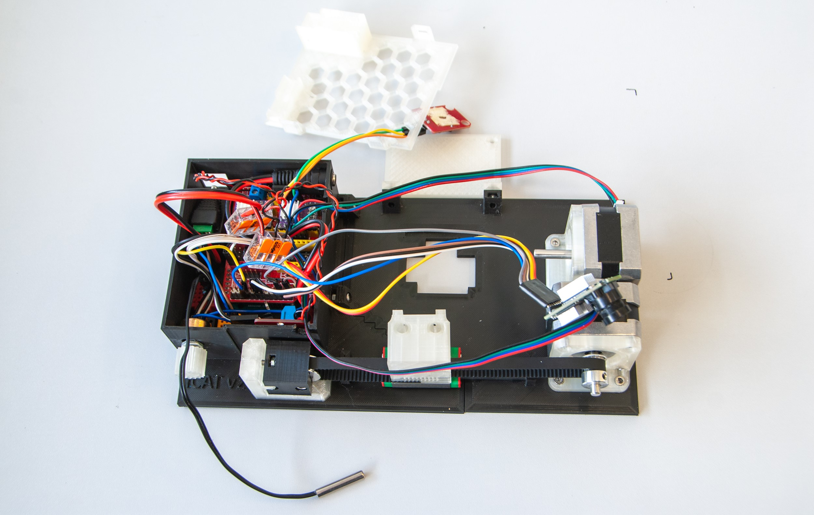
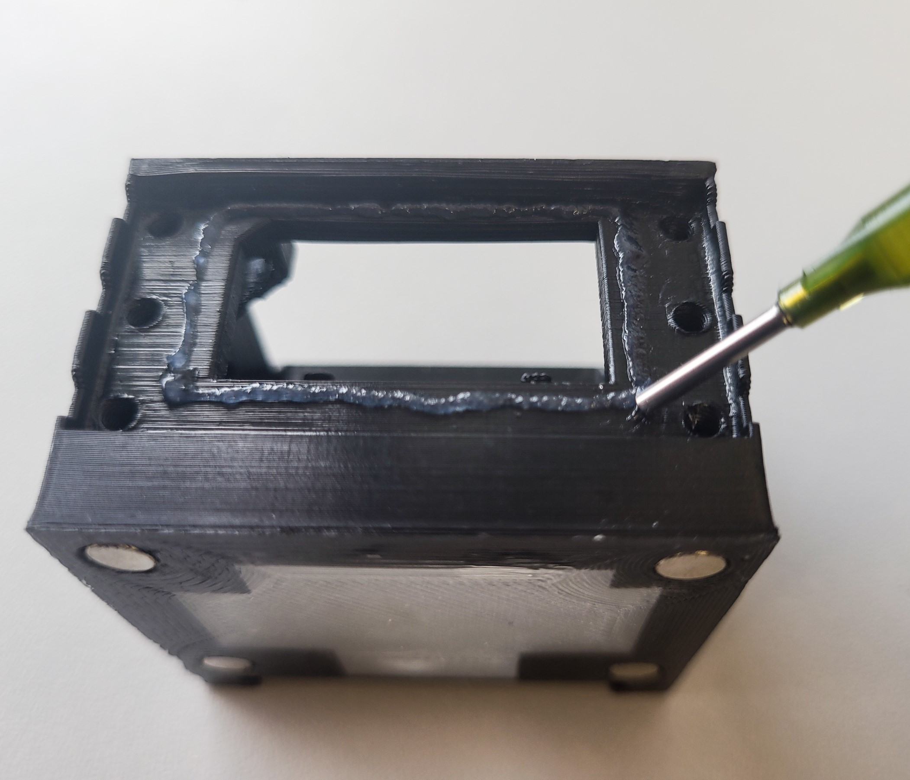

# iCAT: A Multifunctional Open-Source Platform for Advanced Light Microscopy
"i" - Intuitive: iCAT represents an innovative approach to light microscopy, incorporating advanced features like intuitive axial rotation and tracking. It introduces a novel solution for imaging and studying biological specimens with enhanced capabilities, pushing the boundaries of traditional microscopy techniques. <br>
"C" - Controlled: iCAT offers precise control over specimen rotation, temperature regulation, and lighting conditions, ensuring optimal imaging conditions and experimental reproducibility. <br>
"A" - Axial: iCAT's unique capability to rotate specimens along their axial axis sets it apart from conventional light microscopy techniques, allowing researchers to observe dynamic processes and capture detailed time-lapse sequences. <br>
"T" - Tilt: iCAT offers the unique capability of "Controlled Axial Tilt" providing researchers with a 360-degree perspective. This groundbreaking feature empowers researchers to examine specimens in three dimensions, facilitating the exploration of dynamic cellular processes, developmental biology, and beyond. 
<br><br>
<a id="iCATr-2"></a>
<div style="page-break-before: always;">


# Introduction
In the field of light microscopy, imaging specimens from multiple angles and maintaining controlled temperature conditions are crucial for comprehensive and accurate analysis. To address these challenges, we present iCAT, an open-source multifunctional accessory designed to revolutionize light microscopy capabilities. iCAT enables the rotation of specimens along their axial axis, incorporates an in-built thermometer and Peltier element for precise temperature control, features an integrated LED light source, and is equipped with a camera. This versatile device, controlled by an Arduino-based electronic circuit and a Processing based graphical user interface (GUI), allows researchers to capture detailed images and videos of both fixed and live specimens, such as C. Elegans, Zebrafish, Drosophila, mouse embryos etc. The iCAT accessory, which can be easily 3D-printed and assembled using readily available electrical components, serves as a powerful tool for investigating dynamic cellular processes and complex developmental phenomena. The iCAT 3D model can be visualized in this [video](https://youtu.be/drMLpkQK6RA). 
<br><br>
<div style="page-break-before: always;">


# Design and Functionality
## Rotational Capabilities
The ability to capture images and videos of a specimen from multiple angles is essential for comprehensive analysis. iCAT incorporates a motorized rotation mechanism that enables controlled and precise specimen rotation along its axial axis. Researchers can program the desired rotation parameters through the device's graphical user interface (GUI) and monitor the rotation progress in real-time. The iCAT accessory provides unprecedented flexibility in imaging and studying dynamic processes that require specimen repositioning during time-lapse experiments, such as cell migration or morphogenesis. 
<br>
## Temperature Control
Maintaining a stable and controlled temperature environment is crucial for studying living specimens. iCAT addresses this requirement through an in-built thermometer and a Peltier element. The thermometer constantly monitors the specimen's temperature, while the Peltier element actively regulates the temperature within a specified range. This temperature control feature ensures optimal imaging conditions and facilitates accurate analysis of temperature-sensitive biological processes, including embryonic development. <br>
## Illumination and Camera System
An appropriate and adjustable uniform light source is critical for obtaining images using the internal camera. The intensity of the LED can be adjusted via the GUI and minimizes the need for further external light sources during specimen rotation using the built-in camera. The GUI can control the image resolution, providing researchers with flexibility in controlling camera speed. 
<br><div style="page-break-before: always;">


# Fabrication and Accessibility
One of the key advantages of iCAT is its open-source nature, which promotes accessibility, customization, and collaborative development. The device can be fabricated using 3D printing technology, ensuring low-cost production and ease of assembly. Additionally, all the electrical components required for iCAT can be readily obtained for less than $300, making it feasible for researchers with varying resources and expertise levels to replicate and utilize the device in their laboratories. The control circuit, based on the Arduino platform, is well-documented and can be modified to accommodate specific experimental requirements. 
<br><br>

<br>

# Applications and Impact
The multifunctional capabilities of iCAT open up new avenues for biological research, particularly in the fields of developmental biology, neurobiology, and cellular imaging. By enabling precise specimen rotation, temperature control, illumination, and imaging, iCAT empowers researchers to investigate dynamic processes, observe intricate morphological changes, and capture real-time developmental events. The device has proven particularly effective in the study of model organisms such as C. elegans, Zebrafish, where cell migration, organogenesis, and tissue development necessitate the ability to reposition specimens during time-lapse experiments. <br>
Furthermore, the open-source nature of iCAT fosters collaboration and encourages the scientific community to contribute to its development and enhancement. By sharing the design, software, and documentation, we aim to accelerate scientific progress and provide a versatile tool that can be adapted and customized for specific research needs. <br><br>

# Conclusion
iCAT represents a significant advancement in light microscopy, addressing the limitations of traditional techniques by offering a multifunctional accessory that combines rotation, temperature control, illumination, and imaging capabilities. The open-source nature of iCAT ensures its accessibility, affordability, and adaptability, making it an invaluable tool for researchers in the biological sciences. By providing a platform to investigate dynamic processes and complex developmental phenomena, iCAT contributes to our understanding of fundamental biological mechanisms and facilitates discoveries in various fields of study.
<br><div style="page-break-before: always;">


# Methods
## Supplies
One of the key advantages of iCAT is its open-source nature, which promotes accessibility, customization, and collaborative development. The device can be fabricated using 3D printing technology, ensuring low-cost production and easy assembly. All the electrical and mechanical components required for iCAT can be readily obtained for less than $300, making it feasible for researchers with varying resources and expertise levels to replicate and utilize the device in their laboratories. For an overview of the required components, see the illustrative image and list below.
<br><br>

<br>

### Electronics:
Arduino Uno Rev3, 1x <br>
Arducam 5MP Plus OV5642, 1x <br>
IRF520 Driver Module, 1x <br>
CNC Shield V3, 1x <br>
DRV8825 Stepper Motor Driver, 2x <br>
17HS2408 Stepper Motor, 2x <br>
Peltier plate module TEC1-12706, 1x <br>
NTC Thermistor 10K 1% 3950, 1x <br>
4.7 kOhm resistor, 1x <br>
10 kOhm resistor, 1x <br>
10 kOhm potentiometer, 1x <br>
3W High Power LED Module LED with PCB Chassis for Arduino, 1x <br>
12V 3A Power Supply, 1x <br>

### Accessories:
GT2 Pulley 16 Teeth 5mm bore 6 mm width, 1x <br>
GT2 Idler 20 Teeth 5mm bore 3 mm width without teeth, 1x <br>
GT2 Open Timing Belt 2mm Pitch 6mm Width, 1x <br>
MGN9H 100mm linear guide rail with carriage, 1x <br>
Stainless Steel DIN912 Hexagon Hex Socket Head Cap Allen Bolt Screw, M3x4 (22x), M3x5 (4x), M3x6 (8x), M3x14 (1x) <br>
M3 hex nut, 20x <br>
Microscope Cover Glass, 24x40mm, 10x <br>
Lubricant in the syringe, 1x <br>
Sleeving Cord Protector, 6-12 mm, 1x <br>
Neodymium Magnet 5mm x 2mm, 8x <br>
FEP tube clear 0.8 I.D./1.2 O.D., 10-25 m <br>
FEP tube clear - other sizes, 5 m <br>
Silicon rubber tube 1x2 mm, 3 m <br>

### Wiring:
Female Plug 12V DC Power Pigtail Cable Jack, 2x <br>
Female and Male DC Connectors 2.1x5.5mm, 1x <br>
Crimp Terminals Set Kit, 1x <br>
Dupont Line M-M + F-M + F-F Jumper Wire 10cm, 20CM, 30x <br>
WAGO Terminals Series Splicing Connector 221-413, 2x <br>
Mini Solderless Prototype Breadboard, 3x <br>
Black Jumper Caps, 2x <br>

### 3D print:
3D printer, 1x <br>
3D Printer Filament 1.75mm - transparent, black, 2x <br>

### Tools:
Pipette Pump 10ml, 1x <br>
Borosilicate Glass Pasteur Pipettes, 1x <br>
Crimping Tools SN-58B + 4 jaws, 1x <br>
Screwdriver Set, 1x <br>
*NOTE: The complete shopping list is in the [components sheet](support/support.xlsx).* <div style="page-break-before: always;">


## Instructions
### Part 1: 3D printing
All 3D-printed parts can be made using PETG or PLA filaments. For the 'chamber', it is recommended to use a transparent material for the first three layers to allow the use of transmitted light from a microscope. The 'chamber' can be printed in approximately 4 hours, requiring 10.5 meters of filament. For the remaining parts, black filament is recommended to minimize light reflections. Printing these parts takes about 25 hours and consumes 75 meters of filament. The individual STL and 3MF files and the complete Fusion360 project are in the [3D folder](support/3D). The complete iCAT model can also be loaded from the [mesh folder](support/mesh). The STL data can be visualized using 3D slicer software, while the OBJ file can be opened with any mesh viewer, such as the 3D Viewer application in Windows. <br>

### Part 2: iCAT assembly
To assemble iCAT from individual parts, follow the instructions below. If needed, see the [pinout sheet](support/support.xlsx), and the wiring diagram. 
<br><br>
<!--  -->

<br>

1. Insert all M3 nuts and four neodymium magnets into both 'base' parts. 
<br><br>

<br>

2. Slide the linear guide into the 'base-1', put both 'base' parts together, and secure the connection between them with two M3x6 screws. Attach the 'mounting plate' using two M3x6 screws and secure the 'linear guide' with four M3x5 screws.
<br><br>

<br><br>

<br>

3. Fix the 'motor plates' to 'NEMA motors' using eighth M3x4 screws according to the image below. Attach 'GT2 Pulley' to one of the 'NEMA motor'. The pin connections of this 'NEMA motor' need to be oriented vertically. 
<br><br>

<br><div style="page-break-before: always;">

4. Secure the 'motor plates' on the 'base' using M3x4 screws. 
<br><br>

<br>

5. Insert three M3 nuts into the 'cargo plate-2' and attach the 'GT2 Idler' to it using a M3x14 screw. Cut 33.5 cm of 'GT2 Timing Belt' and pass it through the 'idler'. Fasten the ends of the belt inside the 'cargo' according to the image below. 
<br><br>

<br><div style="page-break-before: always;">

6. Secure the 'cargo' to the 'Linear Guide Carriage' using two M3x4 screws and place the belt on the 'GT2 Pulley' that was previously attached to one of the 'NEMA motors'. Attach the 'cargo plate-2' to the 'cargo plate-1' using prepared screws. Do not overtighten these screws, otherwise the 'base' will bend. 
<br><br>

<br>

7. Insert the M3x6 screws into the mounting holes of the 'Arduino Uno' and plug the 'CNC shield' onto the 'Arduino', ensuring that the pins are properly aligned with the corresponding headers. To adjust micro-stepping (1/16 step), set up the 'M2 pin' of the 'CNC Shield' HIGH by connecting the 'black jumper caps', as shown in the image below. Attach the 'DRV8825 Stepper Motor Drivers' to the 'CNC Shield' and connect the power supply wires to both the shield and the 'WAGO terminals'. 
<br><br>
<span></span>
<br>
*NOTE: Before proceeding any further, the voltage reference (V<sub>REF</sub>) that corresponds to the maximum current that will flow to the stepper motors needs to be set. The maximum current of used stepper motors is 1.8 A. To calculate the Vref, use this equation:* <br>
**V<sub>REF</sub> = I<sub>max</sub>/2** <br>
**V<sub>REF</sub> = 1.8/2 = 0.9 V** <br>
*In order to set up the Vref, plug in the 'Arduino UNO' with 'CNC Shield' and the 'DRV8825 Stepper Motor Drivers' to the USB port, connect the negative probe of the multimeter to the GND, connect the positive probe of the multimeter to the screwdriver tip, set the multimeter to DC Voltage measurement, and use the screwdriver to turn the potentiometer until you get the calculated voltage.* 
<br>

8. Similarly to the previous step, interconnect the 'WAGO terminals' with the 'IRF520 Driver Module' using additional power wires. Next, connect the wire end of the first 'Pigtail Cable Jack' to the 'WAGO terminals'. The wire end of the other 'Pigtail Cable Jack' needs to be connected to the 'IRF520 Driver Module'. If needed, crimp the ends of any wires. 
<br><br>

<br>

9. Attach the 'Ardunio UNO' coupled with the 'CNC Shield' and all the wirings to the 'base' using previously inserted screws. 
<br><br>

<br>

10. Install wiring components on three mini breadboards according to the image below. First, plug '10 kOhm resistor' into the 'Thermistor breadboard'. Shorten the resistor leads, if necessary. Plug '10 kOhm thermistor', while one of its leads connects it with the resistor. Connect the 'Male-Female Dupont wire' to it. This will be connected to the analog input ('Abort pin') on the 'CNC shield' later on. The other 'Dupont wires' need to be connected to the other thermistor lead (ground) and to the second resistor lead (5 V). Second, prepare the 'Trigger IN' breadboard by plugging a '4.7 kOhm resistor' into it and connecting its terminals to the 'Male DC connector'. 'Dupont wires' will be connected to both of these resistor leads later on (step 14) to the ground and to the analog input ('Hold' pin) on the 'CNC Shield'. Third, plug '10 kOhm potentiometer' into the last breadboard. Two 'Dupont wires' will be connected to the side and the middle terminals later on, connecting it to 'PWM digital input' ('Step Y' pin of the 'CNC shield') and to the 'IRF520 Driver Module' signal input. If needed, crimp the ends of any wires. 
<br><br>

<br>

11. Install the 'Potentiometer breadboard' and 'DC Female pigtail' in to the 'base' and cover it with the 'base adapter'. 
<br><br>

<br>

12. Install the 'Trigger IN breadboard' and fit 'Male DC connector' in the 'base adapter'. 
<br><br>

<br>

13. Install the 'IRF520 Driver Module' and plug its 'Dupont wires' (ground, 5 V). Plug the signal input as described in step 10. Fit 'Male DC connector' connected to 'IRF520 Module' in the upper right corner of the 'base'. Secure the 'potentiometer' by its nut and attach the 'knob' to it. 
<br><br>

<br><div style="page-break-before: always;">

14. Install the 'Thermistor' breadboard in the 'base'. Connect 'Dupont wires' of all the 'breadboards' as described in step 10. Connect 'LED' to 5 V, ground, and digital output ('Dir Y' pin) on the 'CNC Shield'. Plug eight 'Dupont wires' to the 'Arducam' and connect them to the 'CNC Shield' according to the [pinout sheet](support/support.xlsx) and the wiring diagram. Test the functionality of the device at this point before attaching the 'lid'. 
<br><br>

<br>

<br>
*NOTE: It is possible to use 5 V and GND pins of unoccupied driver bays on the 'CNC Shield' to connect the 'IRF520 Driver Module' and the 'thermistor'.*
<br><div style="page-break-before: always;">

15. Attach the 'lid' to the 'base' and attach 'Arducam' to the 'cargo' using two M3x4 screws. Install a Sleeving Cord Protector to cover the wiring of the camera. 
<br><br>

<br>

16. Use 'mounting screws' to connect the iCAT's 'mounting plate' to the stage of the microscope. 
<br><div style="page-break-before: always;">

So far, the iCAT was successfully mounted and used in combination with the following microscopes. 
<br><br>
**ZEISS Axio Examiner:**<br>


<br><div style="page-break-before: always;">


**ZEISS Axio Zoom.V16:**<br>


<br><div style="page-break-before: always;">


### Part 3: Chamber assembly
To install the 'cover' on the sample 'chamber', follow these steps: 
<br>
1. Apply grease around the perimeter of the 'chamber' window and gently place the 'Microscope Cover Glass' (coverslip) onto the applied grease. Ensure that the grease spreads evenly under the coverslip and that it is centered.
<br><br>


<br>

2. Secure the attached coverslip with eight M3x4 screws, and tighten the screws gently.
<br><br>

<br>
*NOTE: Be careful when tightening the screws, as the coverslip is fragile. It is recommended to tighten the screws gradually in several rounds, testing the 'chamber' after each round by filling it with water. If no leaks are observed, let the 'chamber' sit overnight on a soft tissue surface. No leaks should be present the following day.*
<br><div style="page-break-before: always;">

3. Slide the Peltier element to the back of the 'chamber'. Place the 'chamber' on the 'base', and connect it to the female DC connector on the side. Focus the camera using the adjustment ring. All iCAT connectors are depicted below. 
<br><br>
<a id="iCAT-21a"></a>

<br>
<a id="iCAT-20a"></a>
<div style="page-break-before: always;">


### Part 4: Installation
1. Download the entire repository, or simply download the [Arduino sketch folder](main/), the [```main.pde```](main.pde) Processing sketch, and install the [Processing application](https://processing.org/download). <br>
*NOTE: If you run the [```iCAT.exe```](processing/iCAT.exe) file directly, you will need to install OpenJDK17, as the [Processing sketch folder](processing/) does not contain Java.*<br>

2. Install the [Arduino IDE](https://www.arduino.cc/en/software). <br>
3. Open the Arduino IDE by opening the [```main.ino```](main/main.ino) file. Next, go to the Library Manager and install the [AccelStepper](https://www.airspayce.com/mikem/arduino/AccelStepper/) and [ArduCAM](https://github.com/dennis-ard/ArduCAM) libraries. Once both libraries are installed, press the 'Verify' button to ensure the installation is successful. <br>
4. Check the path of ```memorysaver.h``` file by hovering the mouse over its name at row 5 in the line ```#include "memorysaver.h"```. Then navigate to its folder and replace it with the [```memorysaver.h```](main/memorysaver.h) file provided, which has the camera definition uncommented: <br>
```#define OV5642_MINI_5MP_PLUS``` <br>
5. Test the iCAT by connecting the Arduino to the PC using USB-B cable, connecting the '12 V main power', the 'trigger IN', and the 'Peltier connector'. Open the [```main.pde```](main.pde) and click on the **Run button** in the upper left corner, this will open the Graphical User Interface (GUI) of the iCAT. 
<br><br>
<a id="processing"></a>
 
<br>

6. Select the port using **Port selection button** to which the iCAT is connected. After successful connection, the message will appear in the console: *"iCAT is ready!"*. <br>
7. Test the functionality of the main components: the LED, heating, motors, and camera. Adjust the camera focus using the [Focus adjustment ring](#iCAT-21a).
<br>


### Part 5: General usage
These instructions can be used to mount and image zebrafish embryos between 0 – 10 dpf using iCAT and confocal microscope or macroscope. Other specimens can be imaged as well. If needed, simply use larger FEP tubes to image larger samples. In such a case, however, the 'chamber' needs to be modified. Using the iCAT in combination with other upright microscopes should be possible however this has not been tested. <br>
1. Cut 9 cm of FEP tube. <br>
2. Insert the FEP tube inside the 'FEP tube adapter'. Attach 1 cm of the silicone rubber tube to the end of the FEP tube. <br>
3. Cover dechorionated embryos with 0.8 % low melting imaging grade agarose with 0.5x Tricaine mesylate on a 3 cm cell culture dish. <br>
4. Attach a borosilicate glass Pasteur pipette to the pipette pump and aspirate one or more zebrafish embryos into the pipette. <br>
5. Insert the tip of the pipette into the silicone rubber tube and gently transfer the embryo to the center of the FEP tube. Allow the agarose in the FEP tube to solidify. <br><br>

 
<br><div style="page-break-before: always;">

6. Gently insert the FEP tube into the 'chamber'. Using a syringe, apply grease inside the openings at the top of the 'chamber'. The grease will fill the gaps and seal the FEP tube in place. 
<br><br>
 
<br>

7. Tight the 'FEP tube adapter' screw to fix it to the axial motor. Clean the grease from the surface of the FEP tube using a soft, lint-free tissue. Rotate the tube as needed to ensure thorough cleaning. Fill the 'chamber' with water. Launch iCAT and set up the desired 'chamber' temperature using the [GUI](#processing). <br>
*NOTE: Depending on the surrounding temperature and the specific model of the Peltier element used, the setup temperature might fluctuate slightly. This can result in inconsistent imaging during long time-lapse experiments due to the expansion and contraction of the 'chamber'. To mitigate this, adjust the heating output using the adjustment knob. Turning the knob counterclockwise decreases its power, while turning it clockwise increases it. Further fine-tuning can be done in the* [```main.pde```](main.pde) *Processing sketch by increasing or decresing *```peltPower```* parameter. Similar to the adjustment knob, decreasing this value reduces the heating power, while increasing it raises the Peltier output.*<br>
```
if(valueDiff <0 ) {
    peltPower = 5;
    output.println();
        output.printf("%02d:%02d:%02d   ", hour, min, sec);
        println("heating OFF");
    peltColor = color(background4);
    write(peltPower, 0, 3);
}
```
8. Use intuitive axial rotation wheel to orient your sample along its x-axis.
<br><div style="page-break-before: always;">


### Part 6: Special functions
This section provides a detailed explanation of the functions of individual [GUI](#processing) buttons and other features of the software. 
<br>

**Reset camera position:** <br>
Use the **Camera slider control** to center the camera preview. If the slider reaches its limits, use the **reset button** to recenter it based on the current view.
<br><br>

**Camera control:** <br>
Use the **Camera resolution buttons** to adjust the resolution. To take a single snapshot, press the **s button**. To activate or deactivate continuous mode, press the **c button**. By default, the camera screen displays the middle portion of the captured image. To scroll up or down, use the Camera vertical crop slider **Camera vertical crop slider**.
<br><br>

**Logging and data storage:** <br>
The iCAT generates following log files within its root folder: <br>
```
iCAT\logs\log\log_YYYY-MM-DD_HH-mm-ss.txt
iCAT\logs\rotate\rotate_YYYY-MM-DD_HH-mm-ss.txt
```
The ```log_*.txt``` file stores all serial communication between the Arduino and the PC to which Processing is connected, while the ```rotate_*.txt``` log specifically records the rotary movements. <br>
The images captured by the camera are stored here: <br>
```
iCAT\logs\log\capture_no_YYYY-MM-DD_HH-mm-ss.txt
```
<br>

**Remote axial control:** <br>
The iCAT controlling software enables remote axial rotation control, which can be achieved in two ways: <br>

1. **File-based control:** The iCAT Processing software continuously monitors the ```iCAT\logs\temp\``` folder for the presence of a ```temp.txt file```. If such a file is found and contains an integer value, the control software adds this value to the current axial position and uses the result as the target angle for axial rotation. The ```temp.txt``` file is subsequently renamed to prevent repeated use.

2. **Trigger-based control:** Remote rotation can also be activated using trigger input (IN) signals. This requires the trigger IN cable to be connected to the [Trigger IN port](#iCAT-20a) and a valid signal to be sent. The signal is a 5 ms, 5 V pulse typically generated by the microscope trigger board via the microscope control software.
<br>
To activate the triggering, the **Interval button** must be active, and rotation angles must be configured within the **Rotation step-size control**. The **upper slider** determines the rotation amount.
<br>
If two different rotation angles are needed for independent, consecutive trigger inputs, the second desired angle can be set using the **bottom slider**. This feature is particularly useful for alternating the specimen's rotation back and forth. To achieve this, configure a value in the **upper slider** and set its negative equivalent in the **bottom slider**.
<br><br>

**Step-size control:** <br>
Additionally, the rotation step-size can also be controlled manually. As with the trigger inputs, set the desired angle(s) using the slider(s). To apply the angle change, press the corresponding **push button**.
<br><br>

**Home point:** <br>
By default, iCAT always recovers the last known axial angle position based on the stored value within this log:
```
iCAT\logs\rotate\rotate_YYYY-MM-DD_HH-mm-ss.txt
```
It is also possible to save the **HOME position** by adjusting the axial angle and pressing the **set H button**. Once this button is active, toggling the **go H button** will move to the saved angle position. If the **set H button** is inactive, pressing the **go H button** will move to the default position — 0°.
<br><br>

**iCAT-ZEN (ZEISS) synchronization:**<br>
iCAT can be fully synchronized with the software that controls the microscope. In our showcase example, we developed integration with the **ZEN software**, which is used to control **ZEISS microscopes**. This integration utilizes custom-made [macros](zen) that need to be loaded into the ZEN macro folder: ```Documents\Carl Zeiss\ZEN\Documents\Macros``` and that need to be run in parallel with the iCAT software.<br>
A demonstration of this integration can be seen in this [video](https://youtu.be/mFEu0ixnI0U).<br>
These macros are used in two steps:
1. During the first step, the [iCAT-mapping_setup.czmac](zen/iCAT-mapping_setup.czmac) macro is activated. This guides the user through the calibration of a 3D space. The user is prompted to focus and center the specimen within two distinct angle orientations, thereby generating a 2D model of the specimen's orientation within the FEP tube.
2. Once the mathematical model is created, the user can activate the [iCAT-mapping_sync.czmac](zen/iCAT-mapping_sync.czmac) macro to enable automatic synchronization of the focus and the stage with axial rotation adjustments. This feature is particularly useful when the specimen is mounted eccentrically.
<br><div style="page-break-before: always;">


### Start imaging!

<br><br>
